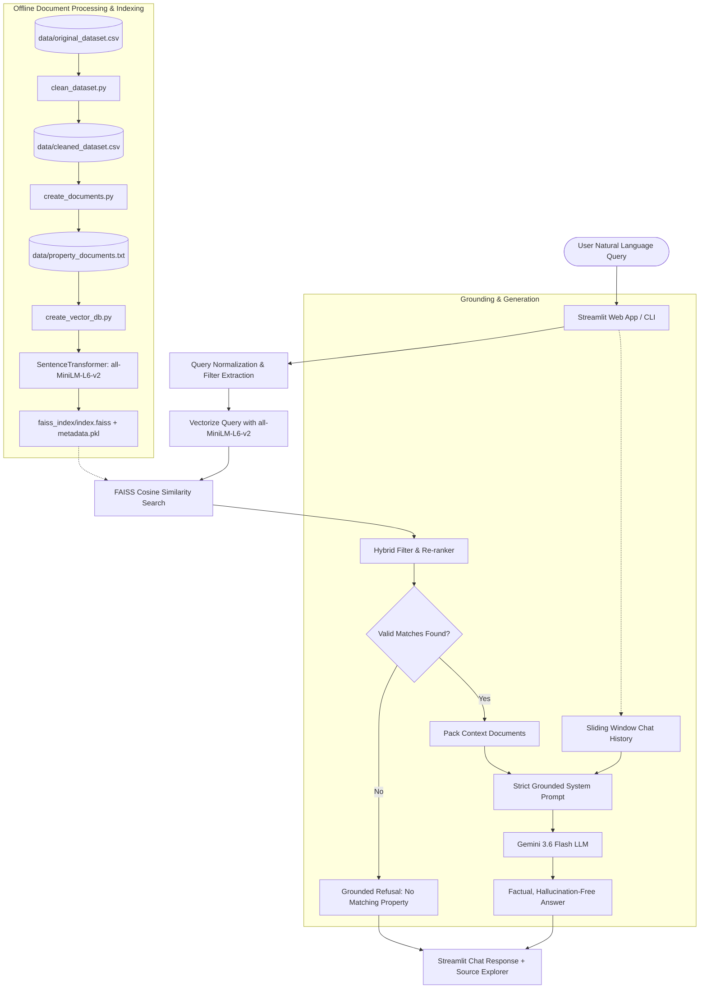

# 🏠 Chennai Real Estate AI Chatbot (RAG + FAISS + Gemini)

An enterprise-grade, retrieval-augmented generation (RAG) conversational assistant designed to help homebuyers and investors query verified residential real estate properties in Chennai with high precision and zero hallucinations.

---

## 1. 📌 Project Title
**Chennai Real Estate AI Chatbot (Real-Estate-RAG)**  
*Domain:* Chennai Residential Real Estate  
*Core Framework:* FAISS Vector Index + Sentence Transformers + Google Gemini 3.6 Flash + Streamlit  

---

## 2. 🎯 Project Objective
The primary objective of this project is to build an intelligent, context-grounded AI assistant capable of:
- Understanding natural language real-estate queries with various phrasing styles (e.g., "three BHK", "3 bhk", "under 50 lakhs", "ready to move").
- Retrieving relevant Chennai residential properties using semantic vector search with FAISS.
- Eliminating hallucinations by strictly enforcing factual grounding on verified dataset records.
- Preserving multi-turn conversational context so users can ask natural follow-up questions (e.g., "Which one is cheaper?").
- Providing both a modern, interactive Streamlit web dashboard and a CLI interface for flexible usage.

---

## 3. ⚠️ Problem Statement
Traditional property search portals rely strictly on rigid SQL/keyword filters. When buyers ask questions in natural language like *"Do you have spacious 3 BHK ready to move flats in Anna Nagar under 2.5 crores?"*, keyword systems often fail due to synonyms, grammatical variations, and subtle phrasing. 

Conversely, standard Large Language Models (LLMs) without retrieval hallucinate non-existent property prices, fake locations, fabricated hospital distances, and unrealistic loan schemes.

**Solution:** This project addresses these challenges by implementing a private RAG pipeline backed by a local FAISS vector store that indexes 2,110 Chennai properties, combined with strict grounding prompt engineering that prevents the LLM from fabricating ungrounded information.

---

## 4. 🛠️ Technologies Used
- **Python 3.10+ / 3.14**: Core runtime environment
- **FAISS (`faiss-cpu`)**: High-performance vector index for dense semantic search (Inner Product / Cosine Similarity)
- **Sentence Transformers (`all-MiniLM-L6-v2`)**: Dense embedding model mapping documents and queries into 384-dimensional space
- **Google GenAI SDK (`gemini-3.6-flash`)**: Next-generation multimodal language model for grounded natural-language synthesis
- **Streamlit**: Interactive web interface with custom real-estate styling, metrics, and source inspection
- **Pandas & NumPy**: Tabular data cleaning, normalization, and vector manipulations
- **Python-Dotenv**: Secure configuration and API key management

---

## 5. 🔄 Architecture



---

## 6. 🚀 Complete RAG Pipeline
1. **Raw Data Ingestion:** Tabular dataset containing 2,620 Chennai property listings loaded from `data/original_dataset.csv`.
2. **Data Cleaning:** Missing values in `bathroom` and `age` handled, strings trimmed and standardized, duplicates purged.
3. **Document Chunking & Synthesis:** Each tabular record converted into a rich, structured natural-language document chunk in `data/property_documents.txt`.
4. **Vector Embedding:** Document chunks encoded into 384-dimensional dense vectors using `all-MiniLM-L6-v2`.
5. **Vector Indexing:** Normalized $L_2$ embeddings stored in FAISS `IndexFlatIP` alongside `metadata.pkl`.
6. **Query Preprocessing:** Normalizes text representations (e.g., converting "three BHK" to "3 bhk", extracting budget limits).
7. **Vector Similarity Search:** Query embedded, normalized, and searched against FAISS index to retrieve top candidate properties.
8. **Hybrid Constraint Enforcement:** Validates that retrieved candidates satisfy explicit user filters (BHK, price caps, locations).
9. **Prompt Engineering:** Context assembled into a strict grounding prompt instructing the LLM to answer solely using the retrieved text.
10. **Generation:** Gemini 3.6 Flash synthesizes a factual, conversational answer.
11. **UI Presentation:** Answer delivered to user with expandable source inspection showing exact property cards and similarity scores.

---

## 7. 📄 Document Processing & Text Cleaning
- **Script:** `clean_dataset.py`
- **Cleaning Operations:**
  - Standardizes column headers to lowercase snake_case.
  - Strips leading/trailing whitespaces from location names, status labels, and builder names.
  - Imputes missing bathroom values with `0.0` (unspecified/standard).
  - Imputes missing age values with `0.0` (indicates new / under construction).
  - Removes duplicate entries (purged 510 duplicates, leaving 2,110 clean listings).
  - Validates numeric boundaries (price > 0, area > 0, BHK > 0).
- **Document Creation:** `create_documents.py` transforms every row into:
  - Formatted key-value fields (`Property ID`, `Location`, `BHK`, `Price`, `Area`, `Status`, `Bathroom`, `Age`, `Builder`).
  - A contextual natural-language summary paragraph designed specifically to match semantic search embeddings.

---

## 8. 🧠 Embeddings (`all-MiniLM-L6-v2`)
- **Model:** `sentence-transformers/all-MiniLM-L6-v2`
- **Output Dimensions:** 384
- **Normalization:** Embeddings are $L_2$-normalized prior to indexing so that dot products equate directly to Cosine Similarity.
- **Speed & Efficiency:** Compact footprint (~90MB model weights), sub-millisecond query embedding on CPU.

---

## 9. 🗄️ FAISS Vector Store
- **Package:** `faiss-cpu` (ChromaDB has been completely removed)
- **Index Type:** `faiss.IndexFlatIP` (Exact Inner Product on normalized vectors)
- **Storage Layout:**
  ```text
  faiss_index/
  ├── index.faiss    # Serialized FAISS vector index (2,110 vectors, 384 dimensions)
  └── metadata.pkl   # Pickled mapping of document texts, metadata dicts, and model configs
  ```
- **Benefits:** Instant local loading (<100ms), zero external server dependencies, persistent disk reuse.

---

## 10. 🔎 Semantic Search & Hybrid Retrieval
- **Script:** `search_vector_db.py`
- Rather than relying solely on exact keyword lookups, semantic search understands user intent:
  - *"Do you have apartments in Chennai?"* -> matches properties with residential descriptions.
  - *"Ready to move flats"* -> matches listings with `Status: Ready To Move`.
- Hybrid filtering blends semantic search with metadata constraint matching to guarantee that explicit limits like "under 50 lakhs" or "3 BHK" are strictly honored.

---

## 11. 🤖 Gemini LLM Integration
- **SDK:** `google-genai`
- **Model:** `gemini-3.6-flash`
- **Configuration:** Reads `GEMINI_API_KEY` securely from `.env`.
- **Resilience:** Includes automatic retry with exponential backoff to handle transient 503/429 server spikes gracefully.

---

## 12. 🛡️ Hallucination Prevention Strategy
Hallucination prevention is paramount in real estate, where fabricating prices, locations, or amenities causes severe misinformation.
1. **Strict Context Isolation:** The system prompt explicitly commands Gemini to answer using ONLY the retrieved context.
2. **Forbidden Fabrications:** Model is explicitly prohibited from guessing nearby hospitals, schools, metro distances, crime ratings, or loan terms.
3. **Deterministic Rejection Gate:** If no properties meet the criteria or similarity is below the relevance threshold, the system returns:  
   *"Sorry, no matching properties were found in the current knowledge base for your specified criteria."*
4. **Attribute Refusal Rule:** When asked about attributes absent from the dataset, the bot strictly responds:  
   *"Sorry, that specific information is not available in the current knowledge base."*

---

## 13. 🧪 Hallucination Testing (`test_hallucination.py`)
An automated verification test suite tests the system against three key scenarios:
1. **In-Domain Answerable Queries:** Confirms accurate retrieval and grounded responses for valid Chennai queries (e.g., "Find 3 BHK in Anna Nagar").
2. **Out-of-Domain / Non-Existent Criteria:** Confirms refusal for out-of-scope cities (e.g., "4 BHK luxury villas in Coimbatore") or unrealistic prices (e.g., "Anna Nagar under 5 lakhs").
3. **Adversarial Attribute Traps:** Confirms strict refusal when baited to invent hospital distances, crime ratings, or loan financing terms.

Run the test suite anytime via:
```bash
python test_hallucination.py
```

---

## 14. 💬 Conversation Memory
- Retains recent conversation turns in memory.
- Enables seamless follow-up resolution:
  - **User:** *"Show me 3 BHK properties in Anna Nagar."*
  - **Assistant:** *[Presents Property 1071 at 190L, Property 462 at 221L, Property 93 at 242L]*
  - **User:** *"Which one is cheaper?"*
  - **Assistant:** *"Among the listed properties, Property ID 1071 is the cheapest at 190.00 lakhs..."*
- **Memory Safety:** Memory is used strictly for conversational reference; property facts must still come from the retrieved knowledge base.

---

## 15. 💻 Installation Guide

### Prerequisites
- Python 3.10 to 3.14 (64-bit)
- Google Gemini API Key

### Setup Steps
```bash
# 1. Clone or navigate to the repository
cd Real-Estate-RAG

# 2. Create and activate a virtual environment
python -m venv venv
venv\Scripts\activate

# 3. Install required dependencies
pip install -r requirements.txt

# 4. Configure your Gemini API Key in .env
echo GEMINI_API_KEY=your_actual_gemini_api_key > .env
```

---

## 16. ▶️ How to Run

### Step A: Build the Vector Database (One-time or after dataset changes)
```bash
# Clean raw dataset
python clean_dataset.py

# Create natural-language documents
python create_documents.py

# Generate FAISS vector index
python create_vector_db.py
```

### Step B: Run the Streamlit Web Application
```bash
streamlit run app.py
```
Open your browser at `http://localhost:8501`.

### Step C: Run the Terminal CLI Chatbot
```bash
python rag_chatbot.py
```

### Step D: Run Semantic Search Testing Utility
```bash
python search_vector_db.py
```

### Step E: Run the Hallucination Test Suite
```bash
python test_hallucination.py
```

---

## 17. 💡 Example Queries
- `"Find 3 BHK properties in Anna Nagar"`
- `"Show properties under 50 lakhs"`
- `"Do you have ready to move apartments in Chennai?"`
- `"What properties are available in Sholinganallur?"`
- `"Show me 2 BHK properties under 60 lakhs"`
- *"Which one is cheaper?"* *(Follow-up query)*
- *"What is the builder name for the first property?"* *(Follow-up query)*

---

## 18. 📁 Project Folder Structure
```text
Real-Estate-RAG/
│
├── app.py                     # Streamlit Web UI application
├── rag_chatbot.py             # Core RAG engine, Gemini client & memory
├── property_search.py         # Structured property search utility
├── clean_dataset.py           # Dataset cleaning & normalization
├── create_documents.py        # Tabular-to-natural-language document generator
├── create_vector_db.py        # FAISS vector index & metadata builder
├── search_vector_db.py        # FAISS semantic vector search CLI
├── test_data.py               # Dataset validation script
├── test_hallucination.py      # Automated hallucination & grounding tests
├── README.md                  # Complete project documentation
├── requirements.txt           # Minimal production dependencies
├── .env                       # Gemini API key configuration (gitignored)
├── .gitignore                 # Git ignore configuration
│
├── data/
│   ├── original_dataset.csv   # Raw Chennai property dataset
│   ├── cleaned_dataset.csv    # Cleaned & standardized dataset (2,110 rows)
│   └── property_documents.txt # Natural-language property document chunks
│
└── faiss_index/
    ├── index.faiss            # FAISS binary vector index
    └── metadata.pkl           # Pickled document texts & property metadata
```

---

## 19. 🔮 Future Improvements
1. **Multimodal Property Search:** Support property floorplan images and elevation photos in the vector index.
2. **GPS Proximity Calculations:** Integrate actual geographic coordinates (latitude/longitude) to calculate real distances to schools and transit stations.
3. **User Loan EMI Calculator:** Add interactive financial calculations for monthly mortgage estimates.
4. **Voice Interface:** Integrate WebRTC / Speech-to-Text for voice-driven property searching.